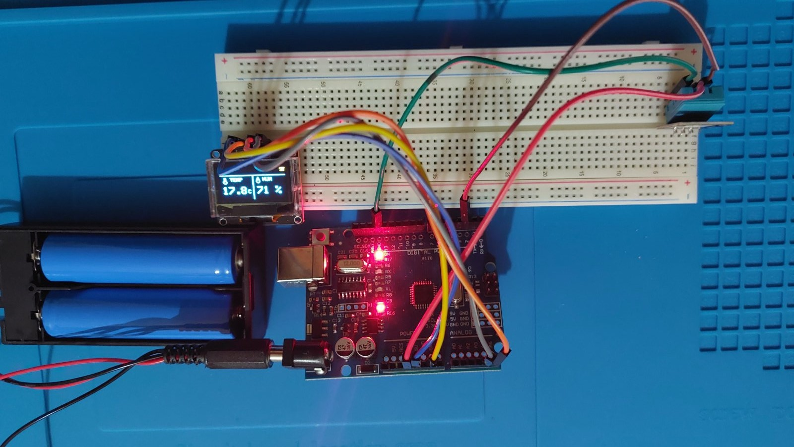
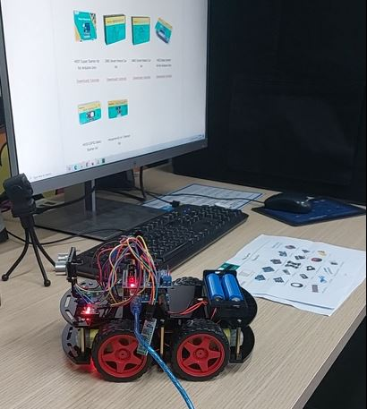

# Arduino Mini Projects

Mini εκπαιδευτικά Arduino projects σχεδιασμένα για αρχάριους, σχολικά εργαστήρια και μικρά demos με αισθητήρες, οθόνες και robot kits.  
Στόχος του repository είναι η απλή, κατανοητή και πρακτική εισαγωγή στον προγραμματισμό μικροελεγκτών μέσα από έτοιμα αλλά επεκτάσιμα παραδείγματα στα Ελληνικά.

---

## Δομή Repository

Κάθε project βρίσκεται σε δικό του αριθμημένο φάκελο:

- `01_*` → πρώτο project  
- `02_*` → δεύτερο project  
- κάθε φάκελος περιλαμβάνει:
  - το βασικό `.ino` αρχείο
  - δικό του `README.md`
  - εικόνες ή επιπλέον υλικό (π.χ. wiring photos)

---

## Projects

---

### 01 — OLED DHT11 Mini Dashboard

📁 Φάκελος: `01_oled_dht11_dashboard/`

Ένα μικρό και κατανοητό Arduino project για αρχάριους που υλοποιεί ένα απλό περιβαλλοντικό dashboard σε OLED οθόνη.

#### Τι υλοποιεί:
- OLED SSD1306 128x64 (I2C)
- Ανάγνωση θερμοκρασίας και υγρασίας από DHT11
- Εμφάνιση:
  - Scrolling τίτλου στην πάνω μπάρα
  - Θερμοκρασίας (με 1 δεκαδικό)
  - Υγρασίας (%)
  - Εικονιδίων (θερμόμετρο & σταγόνα)

#### Εκπαιδευτική αξία:
- Χρήση αισθητήρων (DHT11)
- Διαχείριση οθόνης OLED
- **Μη μπλοκαριστικός κώδικας** με `millis()` αντί για `delay()`
- Βασική δομή dashboard UI σε embedded περιβάλλον

#### Αρχεία:
- `oled_dht11_dashboard.ino`
- `README.md`

---

### 02 — Hosyond 4WD Master (Teacher Edition)

📁 Φάκελος: `02_hosyond_4wd_master/`

Ένα ολοκληρωμένο εκπαιδευτικό project για Arduino βασισμένο σε 4WD robot car kit, σχεδιασμένο για εργαστηριακή χρήση και επίδειξη βασικών εννοιών ρομποτικής.

#### Βασικές λειτουργίες:

**1. MANUAL CONTROL**
- IR Remote
- Bluetooth
- Serial Monitor

**2. LINE TRACKING**
- 3 αισθητήρες γραμμής
- βασική αυτόνομη πλοήγηση

**3. OBSTACLE AVOIDANCE**
- Ultrasonic sensor + Servo
- περιβαλλοντική σάρωση (scan)
- **fail-safe λογική** ώστε το όχημα να μη κινείται “στα τυφλά”

#### Εκπαιδευτική αξία:
- Συνδυασμός πολλαπλών εισόδων (IR, Bluetooth, αισθητήρες)
- Εισαγωγή σε autonomous behavior
- State-based προγραμματισμός (modes)
- Ανάπτυξη λογικής αποφυγής εμποδίων

#### Αρχεία:
- `Hosyond_4wd_Master_TeacherEdition.ino`
- `README.md`

---
